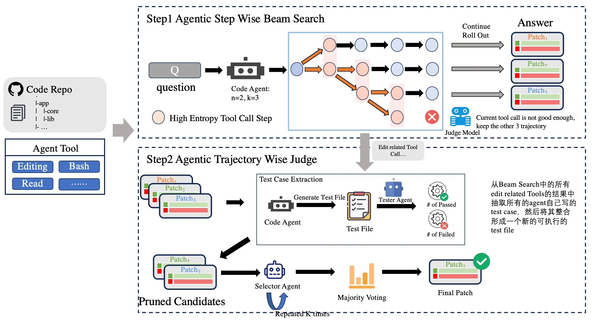

## CodeFuse-Agent
**Codefuse-Agent** is a state-of-the-art framework for Automated Program Repair (APR) designed to significantly enhance the accuracy and efficiency of software bug fixes through a multi-dimensional, multi-layered strategy. While traditional APR methods are often confined to single-path searches, Codefuse-Agent innovatively combines **Step-wise Optimization** with **Trajectory-wise Verification**, building a dynamic, robust, and scalable repair system.

We believe that high-quality code repair requires not only powerful generation capabilities but also precise judgment and verification mechanisms. Codefuse-Agent is built to solve this core challenge.

> 📦 **Note**: Core code is being prepared and will be open-sourced soon. Stay tuned!

---

## 🚀 Core Features

The core capabilities of Codefuse-Agent are built upon two synergistic strategies:

### 🛠️ PyCfuse
框架

### 🛠️ TTS

#### 🧭 Strategy 1: Step-wise Repair - Intelligent Path Exploration

This strategy focuses on how to efficiently explore and sample the most promising repair paths during the patch generation process.

- **🎯 Tool Entropy Dynamic Scheduling**
  - **Challenge**: The APR process involves multiple tools (e.g., compilers, static analyzers, LLMs). How can we balance their performance with the time cost of invocation?
  - **Solution**: By quantifying the uncertainty (entropy) of tool selection, we dynamically assign higher invocation weights to tools with high potential but low utilization. This enables more effective exploration within a limited time budget.

- **🔍 Beam Search for Diverse Sampling**
  - **Challenge**: How can we ensure patch diversity and high quality with a small number of samples (a small K value)?
  - **Solution**: We employ the Beam Search algorithm, which retains the Top-K best candidates at each step instead of choosing a single best path. This allows us to explore far more possibilities than K trajectories with minimal computational cost, significantly increasing the chance of finding the correct fix.

- **⚖️ Judge Model for Precise Assessment**
  - **Challenge**: Among multiple generated patches, how can we quickly identify the most likely correct one?
  - **Solution**: We have trained a specialized Judge Model. Using contrastive learning, it learns the deep semantic differences between "good patches" and "bad patches," enabling it to quickly and accurately score patch quality, which serves as a key basis for filtering or re-ranking.

---

#### 🛠️ Strategy 2: Trajectory-wise Repair - Multi-candidate Post-verification

Our post-hoc verification and selection framework enables flexible, composable strategies for identifying the highest-quality patch from a pool of candidates generated by multiple repair trajectories. We support **three orthogonal post-validation mechanisms**, which can be **independently applied or arbitrarily combined** to construct a robust final patch selection pipeline:

- **📊 DeiBase Scoring**  
  This approach leverages a well-defined, rubric-based evaluation protocol. A dedicated *scoring agent* automatically retrieves relevant contextual information from the codebase (e.g., documentation, function signatures, historical fixes) and synthesizes targeted test cases to assess each candidate patch. The agent then assigns a quantitative score reflecting correctness, completeness, and adherence to project conventions. Patches are ranked based on these scores, providing a principled ordering for downstream selection.
- **✅ Test Case DeiBase**  
  Inspired by empirical debugging patterns observed across multiple repair trajectories, this strategy extracts and generalizes self-debugging behaviors into new, executable test cases. A *test agent* executes these synthesized tests against all candidate patches and reports structured outcomes in the form of `{"passed": xx, "failed": xx, "total": xxx}`. This empirical validation signal serves as a strong proxy for functional correctness and is used to rank patches accordingly.
- **🎯 Preference Selector**  
  Acting as the final decision layer, the Preference Selector integrates ranking signals from either (or both) of the above strategies. It may start with a coarse-grained Top-K recall based on DeiBase Scoring or Test Case DeiBase results, then apply advanced refinement techniques—such as **majority voting across validation dimensions**, **consistency filtering**, or even **learned preference models** trained on human feedback—to converge on a single, high-confidence patch. Crucially, this selector is *strategy-agnostic*: it can operate on any ranked list produced by the upstream validators, enabling seamless composition of verification signals.

By decoupling validation logic from selection logic and supporting arbitrary combinations of these three mechanisms, our framework offers both **flexibility** (to adapt to different project contexts) and **robustness** (through multi-faceted verification), ultimately increasing the reliability of automated program repair.

---

## 🤝 Contributing

We warmly welcome community contributions! Whether it's proposing new ideas, reporting bugs, or submitting pull requests.

Please refer to our [Contributing Guidelines](CONTRIBUTING.md) for details.

---

## 📄 License

This project is licensed under the [Apache License 2.0](LICENSE).

---

## 🙏 Acknowledgments

We thank all the researchers and engineers who have contributed to this project. Special thanks to the Codefuse team for their strong support.

---

📦 Resources: Code will be coming soon.

